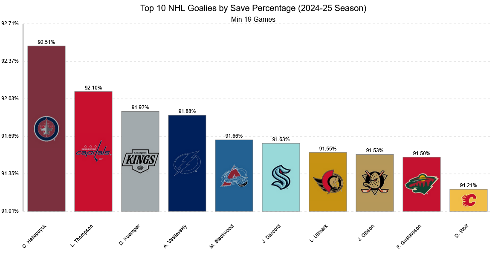

# NHL Goalie Save Percentage Visualization

This project creates a real-time current bar graph showing the top 10 NHL goalies by save percentage for the current season from the NHL website. Each bar in the graph is filled with the goalie's team logo and team colors.

## Features

- Fetches real-time data from the NHL Stats API
- Displays save percentages for goalies with minimum 19 games played
- Uses team logos and colors for visual representation
- Creates an SVG output for high-quality visualization
- Includes hover effects and grid lines for better readability

## Sample Output

The script generates an SVG file that looks like this:


## Requirements

- Python 3.10 or higher
- pip (Python package installer)
- Virtual environment (recommended)

## Installation

1. Clone this repository:
```bash
git clone https://github.com/yourusername/nhl-goalie-stats.git
cd nhl-goalie-stats
```

2. Create and activate a virtual environment (recommended):
```bash
# On Windows
python -m venv venv
venv\Scripts\activate

# On macOS/Linux
python3 -m venv venv
source venv/bin/activate
```

3. Install required packages:
```bash
pip install -r requirements.txt
```

## Usage

1. Make sure your virtual environment is activated
2. Run the script:
```bash
python nhl_goalie_stats.py
```

The script will:
1. Fetch current NHL goalie statistics
2. Process the data to find the top 10 goalies by save percentage
3. Generate a bar graph with team logos and colors
4. Save the output as 'nhl_goalie_save_percentages.svg'

## Output Files

- `nhl_goalie_save_percentages.svg`: The main visualization output
- Console output will show:
  - Data fetching progress
  - Available data columns
  - Top 10 goalies' statistics

## Project Structure

- `nhl_goalie_stats.py`: Main script file
- `requirements.txt`: Python package dependencies
- `Logos_JPG/`: Directory containing NHL team logos
- `README.md`: This documentation file

## Data Source

This project uses the NHL Stats API to fetch real-time goalie statistics. The data includes:
- Save percentages
- Games played
- Team information
- Player names

## Notes

- The script filters for goalies with at least 19 games played
- Team logos are sourced from the NHL's official assets
- The visualization is created in SVG format for optimal quality at any size
- Bar colors are selected to complement each team's branding

## License

This project is licensed under the MIT License - see the LICENSE file for details.

## Acknowledgments

- NHL Stats API for providing the data
- NHL for team logos and branding
- All NHL trademarks and copyrights are the property of their respective owners 